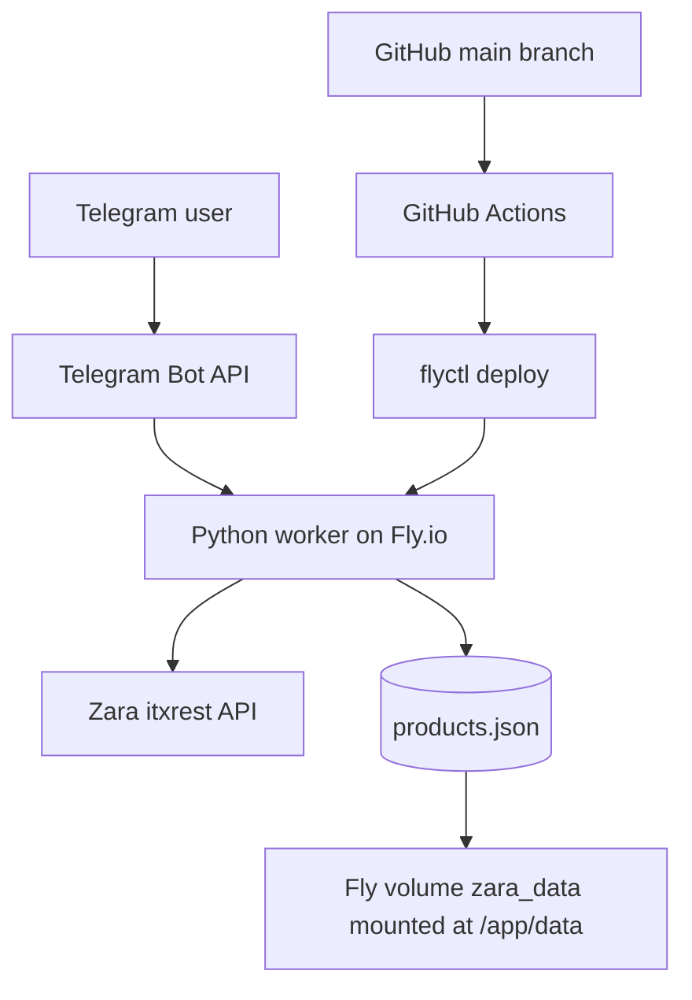
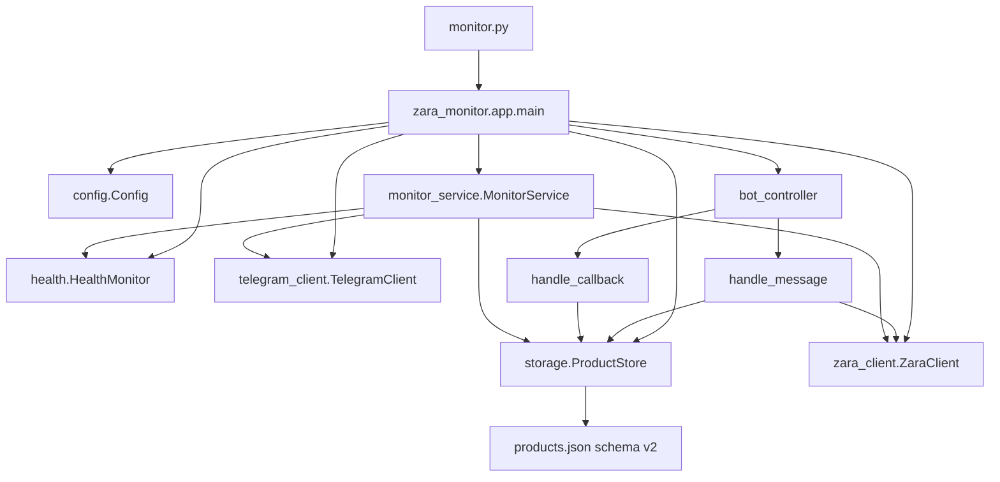
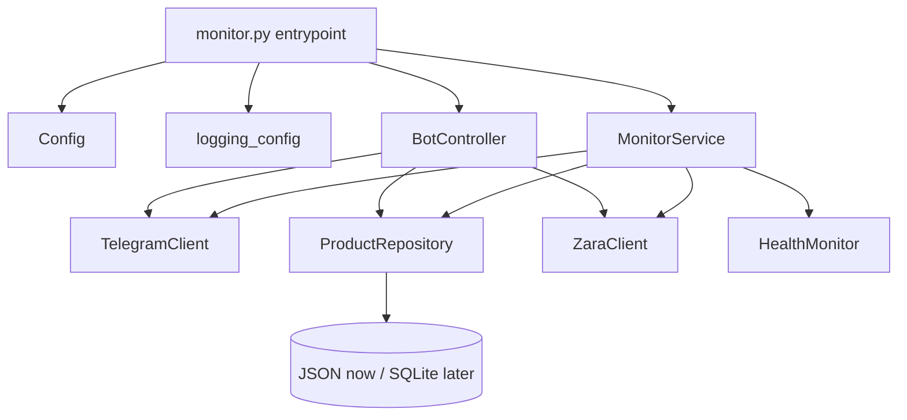
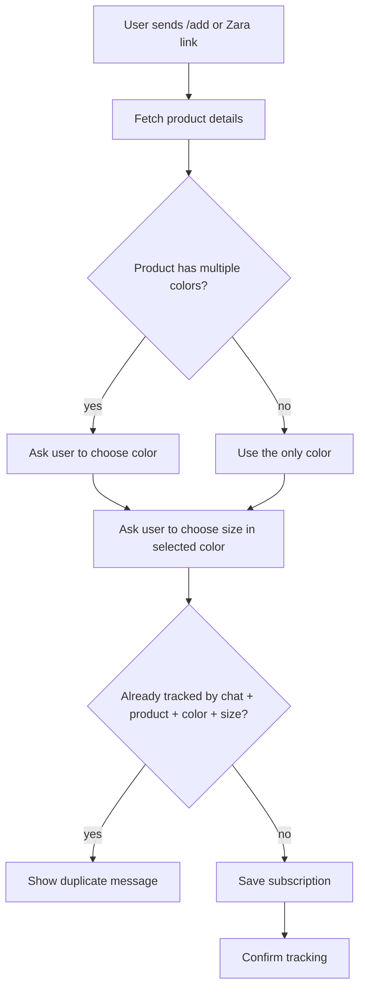
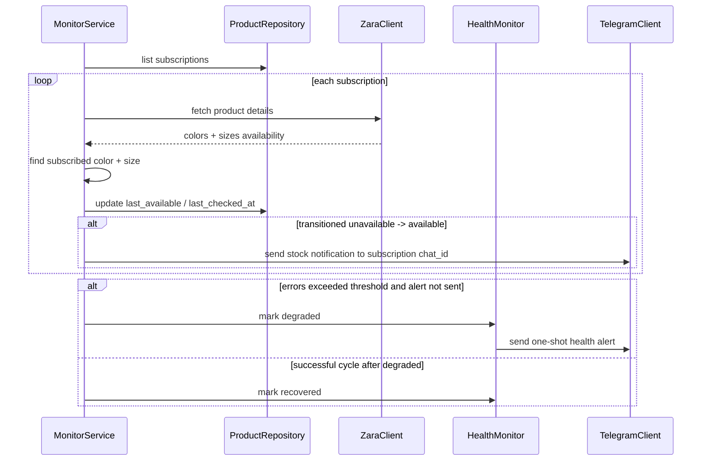
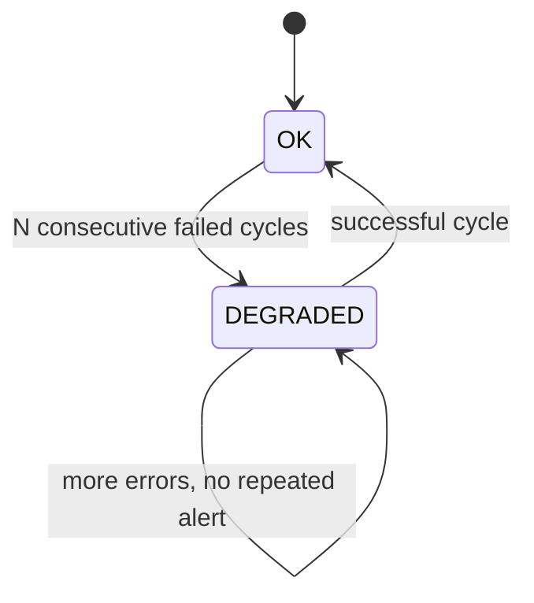
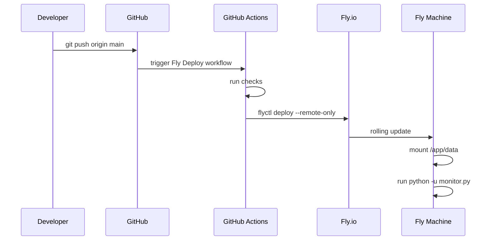

# Zara Stock Monitor — System Design

Этот документ нужен как контекст для будущих правок агентами/разработчиками. Он описывает текущую архитектуру, целевую архитектуру, ограничения, roadmap и тестовый план.

## Project tree

Актуальное дерево верхнего уровня:

```text
zara-monitor/
  .github/
    workflows/
      fly-deploy.yml        # CI checks + Fly.io deploy on push to main
  .claude/
    SYSTEM_DESIGN.md        # этот документ
  data/
    products.json           # локальное persistent state для Docker Compose
  CLAUDE.md                 # проектный контекст для agent-а
  Dockerfile                # Python worker image
  README.md                 # эксплуатационная документация
  SNIFFING.md               # заметки по поиску Zara API
  docker-compose.yml        # локальный запуск
  fly.toml                  # Fly.io app config + volume mount
  monitor.py                # thin entrypoint, imports zara_monitor.app.main
  zara_monitor/
    __init__.py             # compatibility exports
    app.py                  # application wiring / main
    bot_controller.py       # Telegram commands, callbacks, pagination, add flow
    config.py               # env parsing and Config
    constants.py            # constants/env-derived runtime knobs
    errors.py               # typed exceptions
    health.py               # health state and status text
    logging_config.py       # safe logging and token masking
    monitor_service.py      # stock check loop and notifications
    storage.py              # JSON schema v2 storage, migration, dedup
    telegram_client.py      # Telegram API wrapper
    utils.py                # small generic helpers
    zara_client.py          # Zara API wrapper and parsing
  pyproject.toml            # Ruff config
  requirements.txt          # runtime dependencies
  requirements-dev.txt      # dev/CI dependencies
```

## Current runtime architecture



### Runtime properties

- Worker is a background process, not an HTTP service.
- Telegram integration uses long polling via `getUpdates`.
- Zara availability is checked by polling `itxrest/4/catalog/store/{store_id}/product/id/{product_id}`.
- State is stored in `/app/data/products.json` on Fly volume `zara_data`.
- Current app is intended to run as a singleton: only one process may call Telegram `getUpdates` for a given bot token.

## Current code responsibilities

The old monolithic `monitor.py` has been split into the `zara_monitor/` package. `monitor.py` is now a thin entrypoint and compatibility re-export:



Next structural step: split `bot_controller.py` further only if Telegram flows keep growing.

## Target architecture

Целевая архитектура после ближайшего refactor-а:



Recommended modules:

```text
zara_monitor/
  __init__.py
  config.py
  logging_config.py
  models.py
  storage.py
  zara_client.py
  telegram_client.py
  health.py
  monitor_service.py
  bot_controller.py
```

The current project may keep everything in `monitor.py` temporarily, but new logic should move toward this separation.

## Core domain model

The key future-proof model is a subscription scoped to a Telegram chat:

```text
Subscription
  id
  chat_id
  product_id
  product_name
  product_image
  color_id
  color_name
  color_image
  target_size_id
  target_size_label
  last_available
  last_checked_at
  last_error
  created_at
  updated_at
```

### Deduplication key

Do not deduplicate by product name. Names can change and depend on locale.

Current/future dedup key:

```text
chat_id + product_id + color_id + target_size_id
```

For legacy subscriptions without color, use:

```text
color_id = "default"
```

## Add product flow with color support



## Monitoring cycle



## Telegram long polling singleton constraint

Telegram `getUpdates` allows only one active poller per bot token.

If two apps/machines/processes run with the same `TELEGRAM_BOT_TOKEN`, Telegram returns:

```text
409 Conflict
```

Expected behavior:

- log a clear error;
- do not hide the problem behind generic retry logs;
- preferably fail fast after several repeated conflicts;
- make sure only one Fly app/machine is active for the token.

## Health design

Health should be stateful and non-spamming.

States:



Rules:

- Count failed check cycles, not every individual request.
- Send one alert when state changes `OK -> DEGRADED`.
- Optionally send one recovery message when state changes `DEGRADED -> OK`.
- `/status` should always show current state and last error.

Example alert:

```text
⚠️ Zara Monitor: проблема с проверкой товаров

Не могу получить данные от Zara API уже 5 циклов подряд.
Последняя ошибка: HTTP 503 Service Unavailable
```

## Storage decision

### Current pragmatic option: hardened JSON

Keep one JSON file but make it robust:

- schema version;
- atomic write via temp file + `os.replace`;
- backup before write;
- validation on load;
- no silent fallback to empty state when file is corrupt;
- migration from legacy list format.

Recommended shape:

```json
{
  "schema_version": 2,
  "subscriptions": []
}
```

### Future option: SQLite

SQLite becomes preferable when these features grow:

- many users/chats;
- pagination by query;
- historical checks/errors;
- uniqueness constraints;
- migrations.

Current path:

1. Hardened JSON is implemented now: schema v2, migration, atomic write, backup.
2. `/export` remains JSON-compatible for current chat subscriptions.
3. Move to SQLite when subscription/history model grows.

## Error model

Recommended typed exceptions:

```text
ZaraError
  ZaraProductNotFound
  ZaraRateLimited
  ZaraTemporaryError
  ZaraRequestError

TelegramError
  TelegramConflictError
  TelegramRateLimitedError
  TelegramRequestError

StorageError
  StorageCorruptedError
  StorageValidationError
```

Rules:

- `404` from Zara: product may be removed/unavailable.
- `429`: rate-limited; back off.
- `5xx`: temporary; retry/backoff.
- Telegram `409`: duplicate poller; surface clearly.

## Security logging

Never log full Telegram API URLs containing bot token.

Required:

- set `httpx` / `httpcore` loggers to `WARNING` or higher;
- sanitize `bot<token>` patterns in application logs;
- rotate token if it appears in logs/chats/issues.

## Commands roadmap

Implemented commands:

| Command | Description |
|---|---|
| `/help` | Show supported commands and usage. |
| `/cancel` | Cancel current pending flow. |
| `/status` | Show worker/storage/API state. |
| `/check_now` | Run one check cycle immediately. |
| `/list` | Show subscriptions with pagination. |
| `/remove` | Show removable subscriptions with pagination. |
| `/export` | Export current chat subscriptions as JSON if small enough. |

## Pagination design

Recommended page size: 10.

Callback data examples:

```text
list_page:0
list_page:1
remove_page:0
remove_id:<subscription_id>
```

Use subscription id for remove callbacks to keep callback payload short and stable.

## Test plan

### URL parsing

1. Extract `product_id` from `?v1=<id>`.
2. Extract `product_id` from `/product/id/<id>`.
3. Find Zara URL inside shared text.
4. Reject invalid Zara URL without product id.

### Zara parsing

5. Parse one-color product.
6. Parse multi-color product.
7. Parse sizes for selected color only.
8. Handle product without sizes.
9. Handle missing/partial image data.

### Storage

10. Load missing state file as empty valid state.
11. Migrate legacy list state to schema v2.
12. Reject directory at `products.json` path.
13. Reject corrupt JSON without overwriting it.
14. Atomic write creates valid JSON.
15. Backup is created before overwriting existing state.
16. Dedup rejects same `chat_id + product_id + color_id + size_id`.

### Monitoring

17. `last_available=false -> true` sends notification.
18. `true -> true` does not spam.
19. `true -> false` updates state without stock notification.
20. Zara rate limit increments health failure.
21. Repeated failed cycles send one health alert.
22. Successful cycle after degradation resets health.

### Telegram bot flow

23. `/cancel` clears pending flow.
24. `/check_now` calls monitor service once.
25. Unauthorized chat is ignored.
26. Multi-color product asks color first.
27. One-color product skips color step.
28. Duplicate subscription shows duplicate message.
29. `/list` pagination returns correct page.
30. `/remove` pagination removes correct subscription id.

### Config

31. Missing required env fails with clear message.
32. Invalid numeric env fails with clear message.
33. `TELEGRAM_CHAT_IDS` is parsed and normalized.

## Deployment flow



## Operational checklist

Before/after deploy:

```sh
fly status -a zara-monitor
fly releases -a zara-monitor
fly logs -a zara-monitor
```

Check storage:

```sh
fly ssh console -a zara-monitor -C "ls -lah /app/data"
```

Check duplicate apps:

```sh
fly apps list
fly machines list -a zara-monitor
```

## Implementation status

Done:

1. Documentation: README + this design doc.
2. Logging: disabled noisy `httpx` logs and added Telegram token sanitizer.
3. Storage: schema v2, legacy migration to all allowed chat ids, dedup, atomic write, backup.
4. OOP-style clients: `ZaraClient`, `TelegramClient`, typed errors.
5. Health: `/status`, one-shot degraded alert and recovery notification.
6. Deduplication and subscription ids.
7. Color-first add flow.
8. `/cancel`, `/check_now`, pagination.
9. Pytest CI and initial unit tests.
10. Base for multi-user: each subscription has `chat_id`.
11. Physical package split into `zara_monitor/` modules.

Next:

1. Add tests for Telegram callback/message flows with fake clients.
2. Add monitor transition tests: `false -> true`, `true -> true`, `true -> false`.
3. Add optional SQLite migration when state/history requirements grow.
4. Add `/import` or document-based `/export` for large states.
5. Split `bot_controller.py` into smaller modules if needed.
